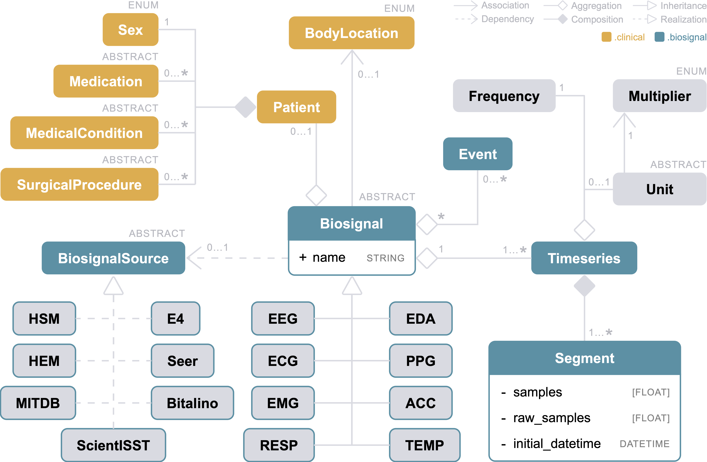

# LTBio Python 101

The LTBio Python Library is the central component of the LTBio Framework. You do not need to be really proeficient in Python, you just need to know the basics.
This is beacause python follows an [Object Oriented paradigm](https://en.wikipedia.org/wiki/Object-oriented_programming), so everything feature is abstracted and encapsulated in a way you do not need to worry about its implementation.

The library offers 7 packages. They work like convenience stores, where you pick to your basket only the igredients (objects) you need to your recipie (your biosignal analysis script).
They are:

1. biosignals
2. clinical
3. processing
4. features
5. ml
6. decision
7. pipeline

This division provides structural organisation in the usual workflow of biosignal analysis. That is, you'll most likely use packages (1) to (6) more or less in this order:


Since the usual workflow of biosignal analysis resembles very much a pipeline, users have package (7) dedicated to automating this workflow with building blocks in the order that is most suitable to their project. However, this is an advanced feature.
The following subsections introduce each of these packages.

## The Anatomy of a Biosignal

The central class of the framework is the `Biosignal` abstract class, present in the `biosignals` package. Every time you read biosignal
data from disk to memory, you have to instantiate a `Biosignal` subclass. Multiple subclasses were made available for the most common
biosignal modalities (see Figure below). 



For example, to instantiate an `ECG` from a file, one could use the following instruction:

```
ecg = ECG('pathToFile', HSM, name='My First Biosignal')
```

In the above example, `HSM` is the `__BiosignalSource` representing "Hospital de Santa Maria" 🏥, a hospital in Lisbon, Portugal.
This class _knows_ how to read biosignals from EDF files collected at HSM. 
As depicted in the above Figure, there can be as many `__BiosignalSource` subclasses as the user needs. The ones you see are just examples, 
like [ScientISST](scientisst.com/sense) and [BITalino](https://www.pluxbiosignals.com/collections/bitalino) devices, public databases like 
MITDB and Seer, and many others. A `__BiosignalSource` is an entity with knowledge about where (devices, hospitals, databases, etc.) and how 
biosignals are acquired. It has static procedures to ease the reading of biosignals from files of that source, and the respective patient 
metadata, clinical records, and event annotations. These have their own classes as well, as shall be described ahead.
Other sources can be easily implemented by deriving `__BiosignalSource`. This scalable property is of vital importance, since biosignal
researchers get data from a large variety of sources that increases by the day. Hence, you have the possibility of working with data from 
new sources only by creating your own `__BiosignalSource`, therefore personalising the framework to your research needs.

------------

### _Biosignal_ as the Atomic Unit

**The Concept:** `Biosignal` objects hold the acquired time series and all the associated metadata. In this way, biosignals can be reused, 
passed around, and serialised, without losing the data necessary for their interpretation. Moreover, holding these properties allow
_Biosignals_ to modify themselves, without you having to remember their metadata.


**The Concept as a Class:** A `Biosignal` object is a non-empty set of channels measuring one biological or physiological variable. Each 
channel is represented by a `Timeseries` object (see UML above). Optionally, it may also have an associated `Patient`, an associated 
`BodyLocation`, one ore more associated `Event`s, an associated `__BiosignalSource`, and a name. All this metadata is introduced later; for now it's crucial you understand how
channels and samples are organised.

------------

### Channels represented as _Timeseries_

**The Concept:** A `Timeseries` object is a discreet sequence of data points that occur in successive order over some period of time.
In a `Biosignal`, the data points of one `Timeseries` are the measurement of a biological or physiological variable, in some unit, taken
from a sensor. These data points are often called samples and are acquired at a fixed sampling frequency. To each timepoint of a
_Timeseries_ domain corresponds one and only one sample, like a mathematical function. However, a _Timeseries_ might be contiguous if a 
sample was acquired at every sampling timepoint, or discontiguous if there were interruptions. Each interval of contiguous samples is called
a `Segment`, but those are managed internally by `Timeseries`.


**The Concept as a Class:** Hence, the internal structure of a `Timeseries` contains a sequence of `Segment` objects, a sampling frequency
(`Frequency`), and optionally it may have associated units (`Unit`) and a name (`string`). The UML above shows these relations.

------------

### Timeseries are made of _Segments_

**The Concept:** A `Segment` is an interrupted sequence of samples.

**The Concept as a Class:** It is an internal and private class of `Timeseries`, used for internal management of samples and interruptions,
so you'll never have to deal with `Segment`s; although it's good you are aware they exist. Internally a `Segment` holds one array of
samples and an initial date and timepoint. Notice, the sampling frequency is a property of `Timeseries`.

------------

### All Metadata lives Together

Now that you understand how channels and samples are organised in a `Biosignal`, it is time to meet what will truly help you in your 
endevours. If you want to have it all in one place regarding one biosignal (and you will!), consider populating your `Biosignal` objects
with more properties:

* 🤕 **Patient**: An object `Patient` where you can drop any information regarding the 
patient that can be useful to process the biosignal. If reading from a file or fetching a database, `__BiosignalSource` might fill this property
automatically for you.

* 🧍‍♀️ **Location**: An object `BodyLocation` to remember where the sensors were placed.

* 🕥 **Events**: An events of interest that occured during the acquisition that can be useful to process the biosignal.
E.g., for event detection projects.

* 🏷️ **Name**: A `string` you want to associate to the biosignal.


## How to Instantiate a Biosignal

Its time you experiment with your own biosignals! 
`Biosignal` is an abstract class, meaning objects cannot be instantiated from it. You need to instantiate one of its **modalities**:

* 🫀 Electrocardiography (ECG) [[See Class](404)]
* 🧠 Electroencephalography (EEG) [[See Class](404)]
* 💪🏼 Electromyography (EMG) [[See Class](404)]
* 🫁 Respiration (RESP) [[See Class](404)]
* 💦 Electrodermal Activity (EDA) [[See Class](404)]
* 🏃🏾‍♂️ Accelerometry (ACC) [[See Class](404)]

These types, each codified in their own class, inherit the properties and general behavior from `Biosignal`. In the following examples, we
will show you how to instantiate an `ECG`, but the example os applicable to any other modality.

You have three ways 🤯 of instantiating a `Biosignal`.

------------

### Way 1: Instantiate from files

Give the path to the directory where the files are located and specify the source (`__BiosignalSource`) from where the files come from:
```
biosignal = ECG("path_to_files", HSM)
```
Here, `HSM` is the "Hospital de Santa Maria" source from previous examples. But you can choose from a variety of sources or, most likely,
you'll want to create your own source.

------------

### Way 2: Instantiate from a Database [comming 🔜]

Give the patient code, the source (`__BiosignalSource`) corresponding to a database, and the interval of time (in tuple) you want to fetch from the database:
```
biosignal = ECG(patient_code=101, source=HSM, ('2022-01-01 16:00', '2022-01-01 17:30'))
```

------------

### Way 3: Instantiate a Biosignal ad-hoc

Give a dictionary where the keys are the channel names and the values are the corresponding `Timeseries` objects:
```
biosignal = ECG({"xx": timeseriesXX, "yy": timeseriesYY, ...})
```

## Indexing a Biosignal

Let's get our hands dirty 👩‍💻! You need to be fluent in manipulating ``Biosignal`` objects as you please, in order to get the most out of
LTBio. Forget everything you know about NumPy and Pandas; here you don't have to manage the internal data structures. You have to treat
``Biosignal``s as self-aware objects.

### Access One Channel

`biosignal['xx']` returns a `Biosignal` only with the channel named `xx`.

> Raises **Index Error** when the given channel does not exist.
>

### Access Multiple Channels

`biosignal['xx', 'yy', ...]` returns a `Biosignal` with all the channels named `xx`, `yy`, ...

> Raises **Index Error** if a given channel does not exist.

### Slice in Time

`biosignal['2022-01-01 12:00' : '2022-01-01 13:30']` returns a `Biosignal` with all the original channels trimmed from 12 AM to 1:30 PM.

`biosignal[datetime(2022, 1, 1, 12) : datetime(2022, 1, 2, 13, 30)]` returns the same.

> Raises **Index Error** when the biosignal is not defined in the interval given.

### Access the sample at one timepoint

`biosignal['2022-01-01 12:00']` returns the recorded sample at 12 AM (`float`).

`biosignal[datetime(2022, 1, 1, 12)]` returns the same.

> Raises **Index Error** when the biosignal is not defined in date and time given.

## Plot a Biosignal

Ok, we want to **see** things! LTBio allows you to instante a ``Biosignal`` and quickly get a preview of it to plot. Just do:

```
biosignal.preview.plot()
```

If your biosignals have hours, it's recomended you use `preview`, which will select a 10-second period of the middle of the acquisition, to
get quick insight of the biosignal. Otherwise, if you do

```
biosignal.plot()
```

you won't be able to see a thing, since the biosignal is very long. What you can do is first select the period you want to plot.
For instance, half an hour:

```
biosignal['2022-05-12 16:00', '2022-05-12 16:30'].plot()
```

You can use the indexing described above as you please. For instance, to see just one channel:

```
biosignal['xx'].plot()
```

or half an hour of one channel:

```
biosignal['xx']['2022-05-12 16:00','2022-05-12 16:30'].plot()
```


